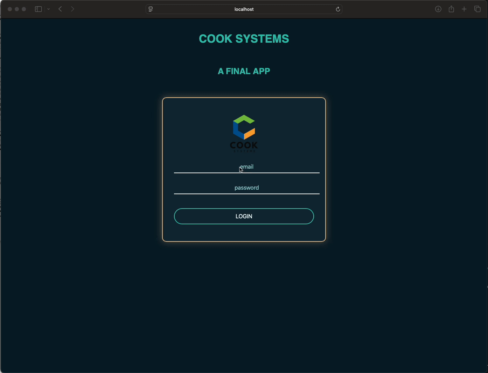
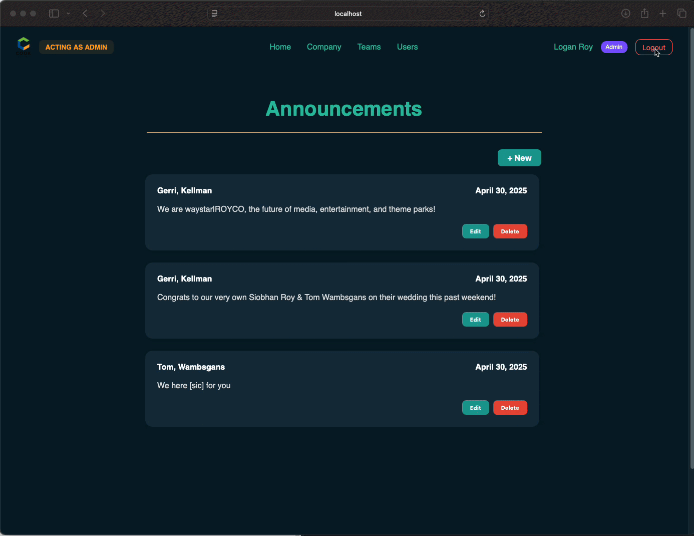
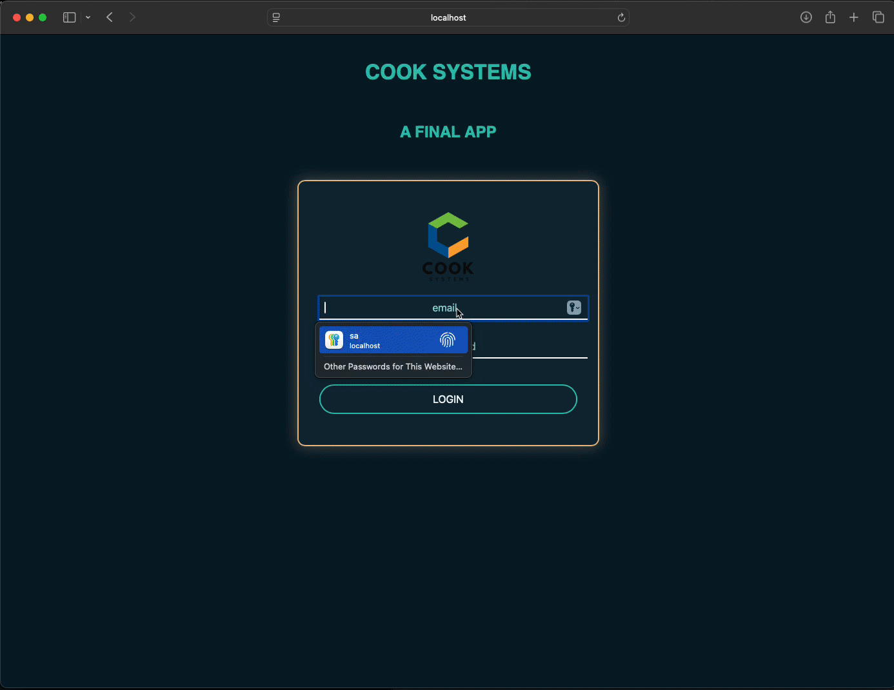
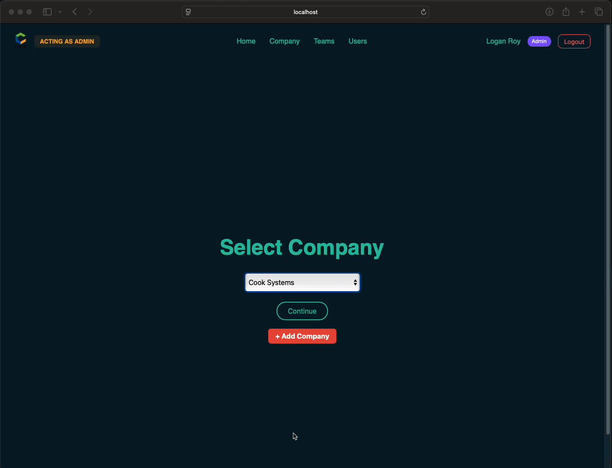
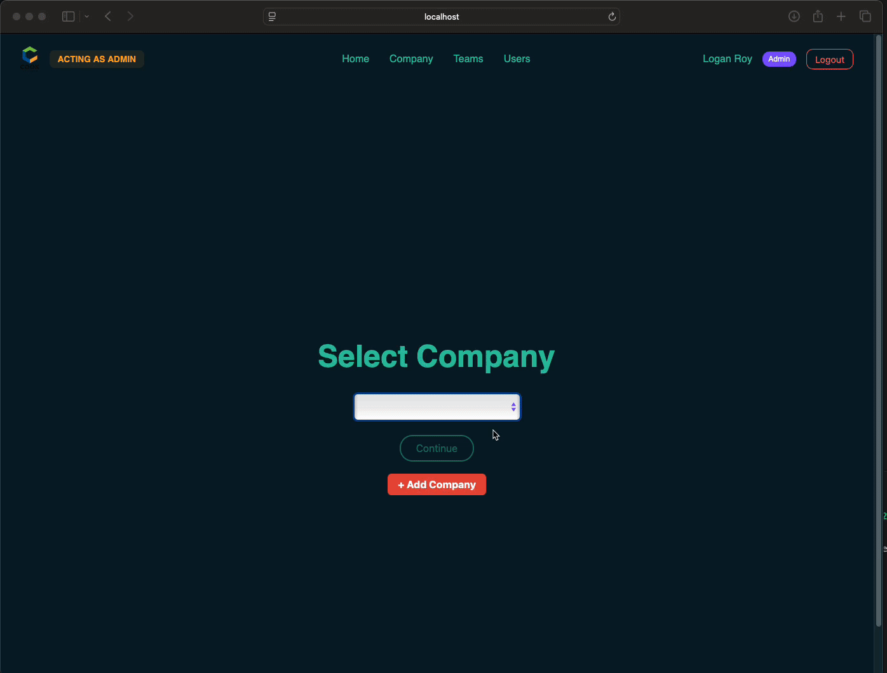

# 🛠️  Full Stack - Project Management Dashboard App

A full-stack application built with **Spring Boot**, **PostgreSQL**, and **Angular** that allows companies to manage users, teams, projects, and announcements.
Built to simulate real-world role-based access and company structures.

## Features
- User authentication and role-based access control (Admin vs Regular User)
- Company, Team, Project, and Announcement management
- Admins can create new users, announcements, and teams
- Regular users can view announcements and projects
- User search and filtering functionality
- Responsive UI matching professional wireframes
- CORS setup for smooth frontend-backend communication
- RESTful backend APIs with secure DTO mappings

## Tech Stack
- **Frontend**: Angular, TypeScript, SCSS
- **Backend**: Java, Spring Boot, JPA/Hibernate
- **Database**: PostgreSQL
- **Hosting**: GitHub Pages (frontend), Render (backend)

## Setup Instructions
1. Clone the repository
2. Set up the backend (`cd backend`, run `mvn spring-boot:run`)
3. Set up the frontend (`cd frontend`, run `npm install` then `ng serve`)
4. Access the app at `http://localhost:4200`

## Future Improvements
- Profile pages for users
- Role-based dashboard customization
- Drag-and-drop task assignment

## ✨ Screenshots

#### 🔐 Login Page

#### 🧑‍💼 Admin Dashboard

#### 👥 Team Management Page

#### 🛠️ Project Management Page

#### 📣 Announcements Feed

#### 🔍 List of all company users: 

## ERD

---

## Wireframe

[Figma Wireframe Link](https://www.figma.com/file/huwXGJxW6BCIbk4p2QcZG2/Final-Prototype?type=design&node-id=0-1&mode=design&t=zTfJ355BqtKPGq2j-0)

